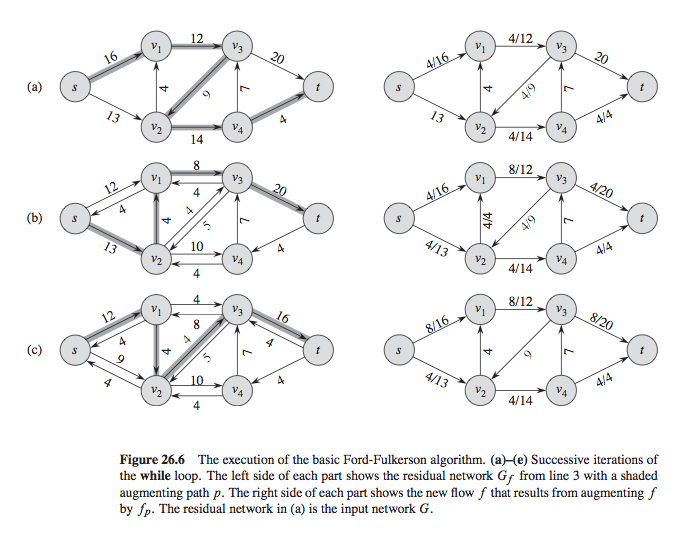

26.2 - 4: Min cut/Max flow
==========================

> **In the example of Figure 26.6, what is the minimum cut corresponding
> to the maximum flow shown? Of the augmenting paths appearing in the
> example, which one cancels flow?**

\
\

### Answer:

26.2 - 11 : connectivity
========================

> **The edge connectivity of an undirected graph is the minimum number
> $k$ of edges that must be removed to disconnect the graph. For
> example, the edge connectivity of a tree is 1, and the edge
> connectivity of a cyclic chain of vertices is 2. Show how to determine
> the edge connectivity of an undirected graph $G = (V,E) $ by running a
> maximum-flow algorithm on at most $|V|$ flow networks, each having
> $O(V)$ vertices and $O(E)$ edges.**

### Answer:

Perfect Matchings
=================

> **A bipartite graph is a graph that contains no cycle with an odd
> number of edges. Recall from the wrestler problem that a graph,
> $G = (V,
>       E)$ is bipartite iff $V$ can be partitioned into two sets $L, R$
> such that all edges in $E$ have one endpoint in $L$ and one endpoint
> in $R$. A matching in a graph is a set of edges $E' \in E$ such that
> each vertex in $V$ is matched at most once, i.e. it is incident to a
> most one edge in $E'$. A perfect matching is a matching where every
> vertex is matched, i.e. is incident to exactly one edge in $E'$. For a
> set of vertices $S \in V$, let $N(S)$ be the set of all neighbors of
> $S$, i.e. $\{y
>     \in V : (x,y) \in \, E $ for some $x \in S\}$\
> Assume we are given a bipartite graph where $|L| = |R|$. Prove that
> there is a perfect matching in $G$ iff $|N(S)| \geq |S|$ for all
> $S \in L$. Hint: Use the Max flow/Min Cut Theorem**

### Answer:

Image segmentation
==================

> **Consider the following problem related to segmenting the pixels of
> an image between foreground and background. We have a picture that
> consists of $n$ pixels. We represent this as an undirected graph $G =
>       (V,E)$ where $V$ is the set of pixels and there is an edge
> $(i,j) \in
>       E$ iff pixel $i$ and pixel $j$ are neighbors in the image
> [^1]**.\
> **We want to find a good segmentation, which is an assignment of each
> pixel to either the foreground or the background. For each pixel $i$,
> we have a likelihood $a_i$ that $i$ belongs to the foreground and a
> likelihood $b_i$ that $i$ belongs to the background. These likelihood
> values are all non-negative. Additionally, for each edge
> $(i, j) \in E$, we have a non-negative separation penalty $p_i,j$
> which is charged if one of $i$ or $j$ is assigned to the foreground
> and the other is assigned to the background. Our problem then is to
> find a partition of the set of pixels into sets $A$ and $B$ so as to
> maximize:**
>
> $$\begin{aligned}
>         \label{imgseg_max}
>         L(A, B) = \sum_{i \in A}  a_i + \sum_{i \in B} b_i − \sum_{(i,j) \in E,
>           | A \cap \{i,j\} | = 1} p_{i,j} 
>         \end{aligned}$$
>
> **Give an efficient algorithm to solve this problem**

### Answer:

This maximization problem stated in [imgseg~m~ax] can be formulated as a
minimization problem instead, that is,

$$\begin{aligned}
    \label{imgseq_min}
    \max(a) = \sum_{i \in A}  a_i + \sum_{i \in B} b_i − \sum_{(i,j) \in E, | A \cap \{i,j\} | = 1} p_{i,j} 
  \end{aligned}$$

$$\begin{aligned}
    \label{blah}
    \min (g') = \sum_{i \in Q} f_i + \sum_{i \in P} b_i + \sum_{i \in P| j \in Q j \in P|i \in Q } p_{ij}. 
  \end{aligned}$$

The above minimization problem can be formulated as a minimum-cut
problem by constructing a network where the source is connected to all
the pixels with capacity $f_i$ and the sink is connected by all the
pixels with capacity $b_i$ Two edges $i,j$ and $j,i$ with $p_{ij}$
capacity are added between two adjacent pixels. The s-t cut-set then
represents the pixels assigned to the foreground in $A$ and pixels
assigned to background in $B$.

Exercise 29.2-2 (Linear Program)
================================

> **Write out explicitly the linear program corresponding to finding the
> shortest path from node $s$ to node $y$ in Figure 24.2(a).**

[-\>,\>=stealth’,shorten \>=1pt,auto,node distance=3cm, thick,main
node/.style=circle,fill=blue!20,draw,font=****]

​(1) 3; (2) [right of=1] 9; (3) [below of=2]
11; (4) [below of=1] 5; (5) [below left of=1]
0;

​(1) edge node [above] 6 (2) edge [bend right] node[left]
2 (4) (2) edge[bend right] node [bend right] 2
(3) (3) edge [bend right] node [right] 7 (2) edge node
[below right] 3 (5) (4) edge [bend right] node [above left]
1 (1) edge node[below] 6 (3) edge node
4 (2) (5) edge node [above left] 3 (1) edge
node [below left] 5 (4);

[fig:figure1]

### Answer:

Exercise 29.2-4 (Network Flow as an LP)
=======================================

> **Write out explicitly the linear program corresponding to finding the
> maximum flow in Figure 26.1(a).**

\

### Answer:

Rock, Paper, Scissors
=====================

> **Rock, Paper, Scissors is a simple 2 person game. In a given round,
> both players simultaneously choose either Rock, Paper or Scissors. If
> they both choose the same object, it’s a tie. Otherwise, Rock beats
> Scissors; Scissors beats Paper; and Paper beats Rock. Imagine you’re
> playing the following betting variant of this game with a friend. When
> Scissors beats Paper, or Paper beats Rock, the loser gives the winner
> \$1. However, in the case when Rock beats Scissors, this is called a
> **smash**, and the loser must give the winner \$10.**

Say you know that your friend will choose Rock, Scissors or Paper, each with probability $\frac{1}{3}$. Write a linear program to calculate the probabilities you should use of choosing each object in order to maximize your expected winnings. Let $p_1,p_2,p_3$ be variables associated with the best way of choosing Rock, Scissors and Paper respectively. Note: If you want to check your work, there are several free linear program solvers on the Internets: check the Wikipedia page on linear programming.
----------------------------------------------------------------------------------------------------------------------------------------------------------------------------------------------------------------------------------------------------------------------------------------------------------------------------------------------------------------------------------------------------------------------------------------------------------------------------------------------------------------------

### Answer:

if $p_1, p_2, p_3$ are the probabilities of choosing the

$$\begin{aligned}
    \label{rps:a}
    \sum_{blah}^{blah} = winnings \\
  \end{aligned}$$

Now say that your friend is smart and, also, clairvoyant: she will magically know the exact probabilities you are using and will respond optimally. Write another linear program to calculate the probabilities you should now use in order to maximize your expected winnings.\
Hint 1: If your opponent knows your strategy, her strategy will be to choose one of the three objects with probability 1.\
Hint 2: Review the LP you wrote for the shortest paths problem.
--------------------------------------------------------------------------------------------------------------------------------------------------------------------------------------------------------------------------------------------------------------------------------

### Answer:

Let $P = $ our profit and $Q = $ our friend’s profit. Let
$P_r, P_p, P_s$ be our probabilities of choosing rock, paper, or
scissors. Let $Q_r, Q_p, Q_s$ be our friend’s winnings when she chooses
rock, paper, or scissors, respectively. Then let her winnings be defined
as

$$\begin{aligned}
      Q_r =& P_p - 10P_s &\text{she picks rock} \\
      Q_p =& P_s - P_r   &\text{she picks paper} \\
      Q_s =& 10P_r - P_p &\text{she picks scissors} \\
    \end{aligned}
    \label{rps:winnings}$$

Then we want to maximize her winnings in [rps:winnings] in such a way to
minimize our winnings.

$$\begin{aligned}
      \label{rps:constraints}
      \max(Q) =& \\
      &\min \begin{cases} Q_r =& P_p - 10P_s \\
                    Q_p =& P_s - P_r   \\
                    Q_s =& 10P_r - P_p \\
                  \end{cases} \\
       0 \leq p_1, p_2, p_3 &\leq 1 \\ 
      \sum_{i=1}^p p_i &= 1 
    \end{aligned}$$

Independent-Set
===============

> **The problem INDEPENDENT-SET asks: Does there exist a set of $k$
> vertices in a graph $G$ with no edges between them? Show that this
> problem is NP-Complete. (hint: Reduce from CLIQUE)**

### Answer:

Via reduction from CLIQUE

### Part one:NP

INDEPENDENT-SET is in NP. Given a vertex set $S$ returned from the
algorithm we can indeed check that $S$ is an independent set of vertices
by checking that each vertex in $S$ is in the graph and that there are
no edges between any two vertices in $S$. A simple BFS or DFS will
handle this in $O(V+E)$ time and INDEPENDENT-SET $\in $ NP.

### Part two: NP-Hard

INDEPENDENT-SET is NP-Hard. Recall that an instance of CLIQUE is a graph
$G$ and an integer $k$. We can convert an instance of CLIQUE to
INDEPENDENT-SET as such: Let $G_c$ be the complement graph of $G$ and
pass $G_c,k$ to INDEPENDENT-SET. Assume that there is a clique $C$ of
size $k \in G$. For any $u,v \in C,
    (u,v) \in E$. Thus, $(u,v) \notin E_c$ and the vertices of $C$ form
an independent set in $G_c$ and $G_c$ is a yes instance from
INDEPENDENT-SET. If $G_c$ is a yes isntance from INDEPENDENT-SET, then
any $u,v \in I,
    (u,v,) \notin E_c$ and $u,v \in E$ and the vertices in I form a
clique in G.

INDEPENDENT-SET is both NP and NP-HARD and as such IS $\in$ NP-Complete.

Exercise 34.5-1 (Subgraph Isomorphism)
======================================

> **The subgraph-isomorphism problem takes two undirected graphs $G_1$
> and $G_2$, and it asks whether $G_1$ is isomorphic to a subgraph of
> $G_2$. Show that the subgraph-isomorphism problem is NP-complete.**

### Answer:

In order to show NP-completeness, we must state the problem as a
decision problem. We can ask if a given graph is isomorphic to a
subgraph of another graph, and in this case, if $G_1$ is isomorphic to a
subgraph of $G_2$, the answer is “true” and “false” otherwise. Let it be
stated that to be isomorphic to another graph, a graph $G = (V,E)$ must
have a subgraph $G_0 = (V_0, E_0) : V_0 \subseteq V, E_0 =
  E\cap(V_0\times V_0)$ such that $G_0 \cong H$? Does a mapping
$f: V_0 \to V'$ exist such that vertices
$v_1, v_2 \in E_0 \Leftrightarrow (f(v_1), f(v_2))
  \in E'$?

By reduction from CLIQUE.\
CLIQUE $\leq_P$ SUBGRAPH ISOMORPHISM. Let $(G = (V,E)k)$ be an input for
CLIQUE and let $G_1$ to be the complete graph on $k$ vertices and $G_2$
to be the graph $G$. $G_1,G_2 \in$ SUBGRAPH ISOMORPHISM iff
$G,k \in CLIQUE$.

[^1]: Note that we’d commonly expect this graph to be a grid, but in
    fact we want to handle any arbitrary graph (to handle, e.g., 3-D
    images, wrapped and warped images, etc)
